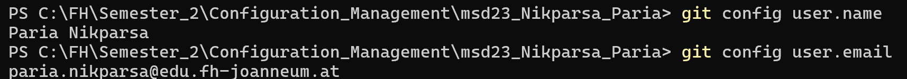
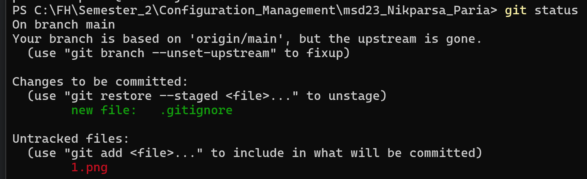
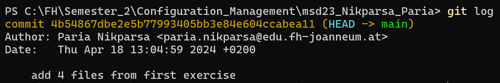

# Exercise 2 - Basic Git Commands

In this exercise, we'll learn about some basic Git commands and how to use them in the terminal or console.

## Introduction
The goal of this exercise is to become familiar with fundamental Git commands and apply them using the command-line interface (CLI) of your operating system.

## Git Commands

| Command       | Description                                                                              |
|---------------|------------------------------------------------------------------------------------------|
| `git config`  | is used to set up Git configuration settings such as user name and email.                |
| `git init`    | is used to initialize a new Git repository in the current directory.                      |
| `git add`     | is used to add specific files or directories to the staging area.                         |
| `git commit`  | is used to record changes made to the repository.                                         |
| `git status`  | shows the current status of the repository, including changes to be committed.            |
| `git log`     | displays a history of commits in the repository.                                          |
| `git diff`    | shows the differences between changes made to files.                                      |
| `git pull`    | is used to fetch and download changes from a remote repository and integrate them locally. |
| `git push`    | is used to upload local repository changes to a remote repository.                        |

## Additional Notes
- **Commit Messages**: Write descriptive commit messages that explain the changes you've made. This helps others understand the purpose of each commit.
- **Branching**: Experiment with creating and switching between branches using `git branch` and `git checkout`.
- **Remote Repositories**: Learn how to add remote repositories with `git remote add` and manage them with `git remote`.
- **Undoing Changes**: Explore commands like `git reset`, `git revert`, and `git checkout` to undo changes in your repository.
- **Gitignore**: Don't forget to create a `.gitignore` file to specify files and directories that Git should ignore.
## Screenshot of some Git Commands
#### git config

#### git status

#### git log

