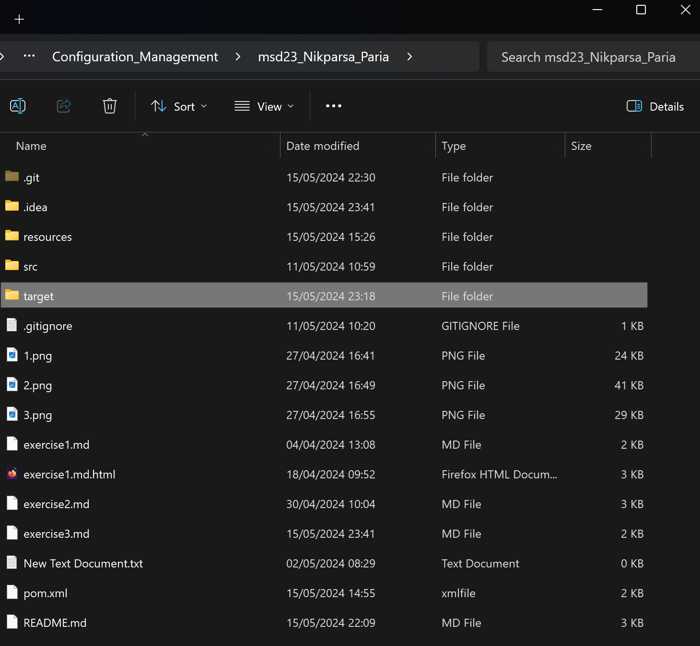

# Exercise 03: Maven (Java) Project Structure and Git

## Exercise Instructions
The goal of the third exercise is to version a Java project using Git and explore various build automation tools.

### Prerequisites
- Install Maven and verify the installation.
- Ensure that Java JDK (preferably OpenJDK) is installed.
- Test your Java and Maven installations by running the following commands in the console:

```bash
mvn -v
java -version
javac -version
```
- Set up the `JAVA_HOME` and `PATH` environment variables to point to your Java and Maven installations. Ensure that the `bin` directories of both Java and Maven are included in the `PATH`.

## Java and Maven Version Information

### java -version
openjdk version "21.0.3" 2024-04-16 LTS

### Javac -Version
 Javac 21.0.3

### Maven -Version
Apache Maven Version 3.9.6 


### New Folder Created

After running the specified command, a new folder was created in the project directory.


