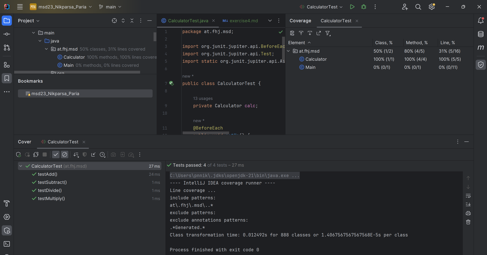
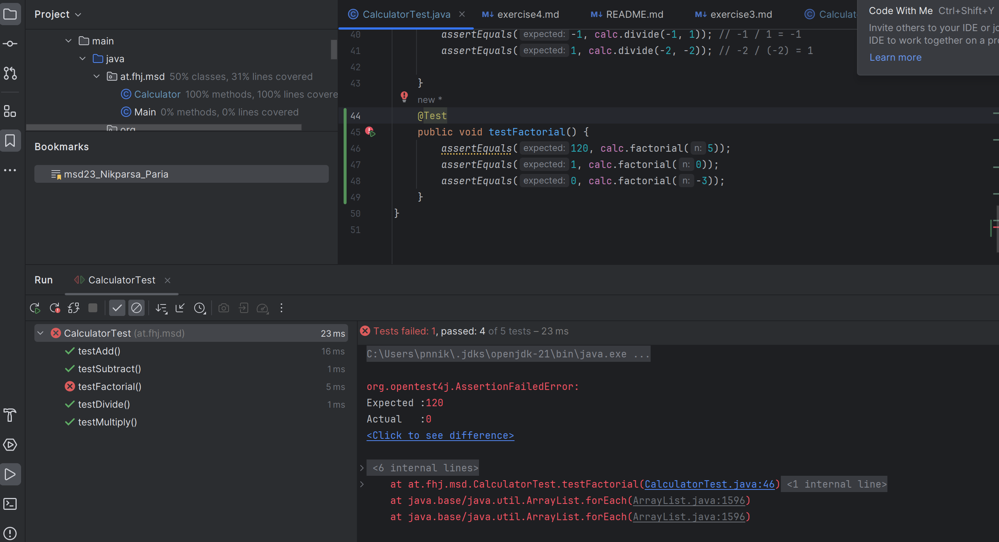

# Exercise 4: JUnit Testing in a Java Project
## Steps

1. Create test package (`test/java`)

2. Create `CalculatorTest.java` in the test package.

3. Initialize necessary objects using `@BeforeEach` or `@BeforeAll`.
   Write at least three test methods per function, covering different cases.

4. Run tests with coverage and take a screenshot showing test coverage.

5. Implement Factorial Method Using TDD:
    - Initially, return 0 for all inputs.
    - Write at least three failing test methods for `factorial(int n)`.
    - Take a screenshot of failing tests (`ex4_2.png`).

7. Implement Factorial Logic:
    - Ensure all tests pass after implementing the logic.
    - Commit the changes.